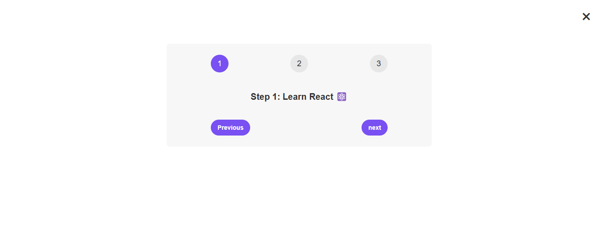

# 🚀 React Step-by-Step Component

This is a simple and interactive React project that demonstrates a step-by-step navigation component. Users can navigate through steps using "Previous" and "Next" buttons, and toggle the visibility of the component with a close button.

## ✨ Features

- 🔢 Step-by-step navigation with three steps
- 🎯 Active step highlighting
- ❌ Toggle visibility with a close button
- 🎨 Clean UI with styled buttons

## 🎬 Demo



## 🛠 Installation

1. Clone the repository:
   ```sh
   git clone https://github.com/ashutoshsitu02/steps.git
   ```
2. Navigate to the project directory:
   ```sh
   cd react-step-component
   ```
3. Install dependencies:
   ```sh
   npm install
   ```

## 🚀 Usage

Run the project in development mode:

```sh
npm start
```

The application will be available at `http://localhost:3000/`.

## 📂 File Structure

```
react-step-component/
│-- src/
│   │-- App.js  # Main component
│   │-- index.js  # Entry point
│-- public/
│-- package.json
│-- README.md
```

## ⚙️ How It Works

- 🏗️ The component maintains a `step` state using `useState`.
- 🔄 Users can navigate forward and backward using the buttons.
- 🌟 The active step is visually highlighted.
- 👀 The component can be toggled using a close button.

## 🛠 Technologies Used

- ⚛️ React
- 💡 JavaScript (ES6+)
- 🎨 CSS (for basic styling)

## 🤝 Contributing

Feel free to fork this repository and submit pull requests. Contributions are welcome! 🚀

## 📜 License

This project is licensed under the MIT License.
